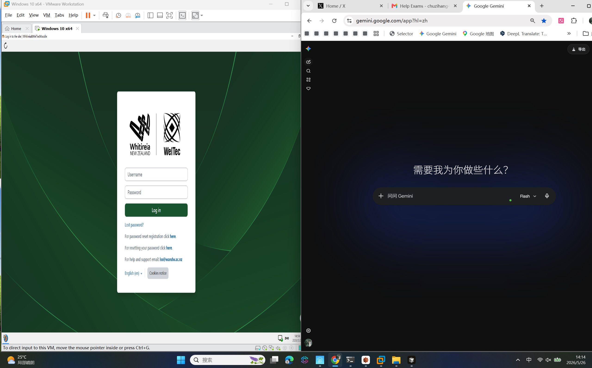

# Safe Exam Browser (SEB) v3.10.1 绕过工具包

[](https://github.com/Tyleraltight/SafeExamBrowser_bypass/stargazers)
[](https://github.com/Tyleraltight/SafeExamBrowser_bypass/network/members)
[](https://github.com/Tyleraltight/SafeExamBrowser_bypass/issues)
[](https://github.com/SafeExamBrowser/seb-win-refactoring)

**[English](README.md) | 中文**



> **仅供教育和研究用途。** 使用者需自行遵守所在机构的相关政策。

在 VMware 虚拟机中运行 Safe Exam Browser。通过 IL 补丁修改 `SafeExamBrowser.Monitoring.dll`，绕过 SEB 的虚拟机检测和显示器验证。

---

## 获取帮助与支持

需要帮助设置？卡在某个步骤了？想要预编译的一键工具包？


- **免费支持**：在 [GitHub Issues](https://github.com/Tyleraltight/SafeExamBrowser_bypass/issues) 中提问
- **优先支持** 联系我的邮箱：chuzihang456@gmail.com 进入群组获取一对一指导
- **预编译工具包**：开箱即用的二进制文件 + 视频教程，通过 群组 获取

## 工作原理

```
宿主机（你的真机）
│
│  Chrome / Edge / 任何应用 ← 完全自由，没有任何限制
│
│  ┌─────────────────────────────────┐
│  │  VMware Workstation（窗口）       │
│  │  ┌─────────────────────────────┐│
│  │  │  Windows 10 虚拟机            ││
│  │  │  ┌─────────────────────┐   ││
│  │  │  │  SEB（已补丁）        │   ││
│  │  │  │  以为自己在真机上运行   │   ││
│  │  │  └─────────────────────┘   ││
│  │  └─────────────────────────────┘│
│  └─────────────────────────────────┘
```

**两个补丁工具完成核心工作：**

1. **`seb-patcher`**（基于 dnlib）— 补丁 `VirtualMachineDetector` 类，使全部 7 个虚拟机检测方法返回 `false`。

2. **`display-patcher`**（基于 Mono.Cecil）— 补丁 `DisplayMonitor.TryLoadDisplays()` 返回一个伪造的内部显示器，并将 `ValidateConfiguration` 设为 `IsAllowed=true`。解决了 VMware 中"检测到 0 个显示器"的错误。

## 运行截图

**成功补丁 — 全部 7 个虚拟机检测方法已禁用：**
```
[*] Patching VirtualMachineDetector...
    [+] IsVirtualMachine()    -> returns false
    [+] HasNoSystemHardware() -> returns false
    [+] HasVirtualDevice()    -> returns false
    [+] HasVirtualMacAddress()-> returns false
    [+] IsVirtualCpu()        -> returns false
    [+] IsVirtualRegistry()   -> returns false
    [+] IsVirtualSystem()     -> returns false

SUCCESS! 7 method(s) patched.
```

**显示器补丁 — WMI 绕过和配置覆盖：**
```
[*] Patching ValidateConfiguration...
    [+] -> returns ValidationResult(IsAllowed=true, Internal=1)
[*] Patching TryLoadDisplays...
    [+] Set Technology = Internal (0x80000000)
    [+] TryLoadDisplays -> returns true with fake internal display

SUCCESS! 6 method(s) patched.
```

**SEB 在 VMware 中正常运行 — 无虚拟机检测、无显示器错误：**
```
Display Monitor: Started!
Disallowed Displays: none.
Allowed Displays: 1.
Application integrity is compromised!（仅警告 — 不会阻止运行）
```

> 想看更多？查看[常见问题排查](#常见问题排查)部分的真实错误日志和修复方案。

## 前置条件

| 软件 | 用途 |
|---|---|
| VMware Workstation 26H1（或更新） | 虚拟化 |
| Windows 10/11 ISO | 虚拟机操作系统 |
| .NET 9.0 SDK | 仅从源码编译时需要 |
| Python 3.10+ | 仅分析工具需要 |
| SEB v3.10.1 安装包 | 从你的学校获取 |

## 快速开始

### 1. 安装 VMware

1. 下载并安装 [VMware Workstation Player](https://www.vmware.com/go/getplayer-win)（免费）
2. 创建新的 Windows 10/11 虚拟机
3. 在虚拟机中安装 Windows

### 2. 配置虚拟机（宿主机操作）

在 VMware 完全关闭后，编辑虚拟机的 `.vmx` 文件：

```
firmware = "bios"
smbios.reflecthost = "TRUE"
hypervisor.cpuid.v0 = "FALSE"
monitor.virtual_exec = "hardware"
```

关键设置说明：
- `firmware = "bios"` — EFI 模式会导致 ISO 启动失败
- `smbios.reflecthost = "TRUE"` — 隐藏 VMware BIOS 信息

### 3. 安装 VMware Tools（虚拟机内操作）

VMware 菜单：**虚拟机 → 安装 VMware Tools** → 在虚拟机中运行 `setup64.exe` → 重启。

安装后可实现：自动适配分辨率、剪贴板共享、拖拽文件。

### 4. 安装 SEB 依赖项（虚拟机内操作）

SEB v3.10.1 需要：
- **.NET Framework 4.8** — Windows 10 1903+ 通常已预装
- **Visual C++ 2015-2022 运行库** — 从 [微软官网](https://aka.ms/vs/17/release/vc_redist.x64.exe) 下载

如果虚拟机里下载太慢，可以在宿主机上下载后通过共享文件夹传入：
1. 在宿主机上下载 `vc_redist.x64.exe`
2. 放到与虚拟机共享的文件夹中
3. 在虚拟机里运行

### 5. 安装 SEB（虚拟机内操作）

将 SEB 安装包复制到虚拟机中，正常安装。

### 6. 打补丁

**方式 A：使用预编译文件（推荐）**

将 `bin/final/` 目录复制到虚拟机中（通过共享文件夹），然后在**管理员 CMD** 中运行：

```cmd
cd <bin\final 路径>
DisplayPatcher.exe
```

然后运行替换脚本（管理员 CMD）：

```cmd
cd <scripts 路径>
force_replace.cmd
```

如果你的路径不同，需要修改 `force_replace.cmd` 中的路径。

**方式 B：从源码编译**

```bash
cd display-patcher
dotnet publish -c Release -r win-x64 --self-contained true
```

输出在 `display-patcher/bin/Release/net9.0/win-x64/publish/`。

### 7. 配置 VMware 反检测（宿主机操作）

在 `.vmx` 文件中添加：

```
smbios.reflecthost = "TRUE"
hypervisor.cpuid.v0 = "FALSE"
isolation.tools.hgfs.disable = "TRUE"
isolation.tools.dnd.disable = "TRUE"
isolation.tools.copy.disable = "TRUE"
isolation.tools.paste.disable = "TRUE"
monitor.virtual_exec = "hardware"
```

### 8. 测试 SEB

1. 在虚拟机中打开 SEB
2. 不再检测到虚拟机，也不会报显示器错误
3. 确认全屏模式正常工作

### 9. 考试当天

1. 打开 VMware → 启动虚拟机 → 全屏（`Ctrl+Alt+Enter`）
2. 打开 SEB → 进入考试页面
3. 宿主机完全自由，可以查资料

**切换快捷键：**

| 操作 | 快捷键 |
|---|---|
| 进入全屏 | `Ctrl+Alt+Enter` |
| 退出全屏 | `Ctrl+Alt+Enter`（再次按下） |
| 切换到宿主机 | `Ctrl+Alt+Enter` 退出全屏 → 点击宿主机任务栏 |

## 项目结构

```
SafeExamBrowser_bypass/
├── README.md                      # 英文文档
├── README_zh.md                   # 中文文档
├── .gitignore
├── requirements.txt               # Python 依赖
│
├── tools/                         # Python 分析工具
│   ├── main.py                    # CLI 入口
│   ├── utils.py                   # 共享工具函数
│   ├── config_analyzer.py         # .seb 配置文件解密/解析
│   ├── env_detector.py            # 虚拟机/远程桌面/监控检测
│   ├── process_monitor.py         # SEB 进程分析
│   ├── kbypass.py                 # 键盘/输入限制分析
│   ├── dll_patcher.py             # 从 nxvvvv 仓库下载预补丁 DLL
│   ├── log_cleaner.py             # 清理 SEB 日志（去除虚拟机痕迹）
│   └── vmx_helper.py              # VMware VMX 配置辅助工具
│
├── seb-patcher/                   # 基于 dnlib 的 IL 补丁（虚拟机检测）
│   ├── seb-patcher.csproj
│   └── Program.cs
│
├── display-patcher/               # 基于 Mono.Cecil 的 IL 补丁（显示器验证）
│   ├── DisplayPatcher.csproj
│   └── Program.cs
│
├── bin/final/                     # 预编译的显示器补丁工具（自包含）
│   └── DisplayPatcher.exe         # 开箱即用，无需 .NET SDK
│
├── scripts/                       # 辅助脚本
│   ├── force_replace.cmd          # 强制替换 SEB 目录中的 DLL
│   ├── check_dll.cmd              # 诊断：检查补丁是否成功
│   ├── fix_display.cmd            # 备选 DLL 替换脚本
│   ├── install_vcpp.ps1           # 在虚拟机中安装 VC++ 运行库
│   ├── copy_vcpp.ps1              # 从宿主机提取 VC++ DLL
│   └── read_logs.ps1              # 快速查看日志
│
└── bypass/                        # 运行时绕过模块（实验性）
    ├── hook_bypass.py             # 键盘钩子绕过（5 种方法）
    ├── window_bypass.py           # 窗口操控（缩放、最小化、隐藏）
    └── clipboard_bypass.py        # 剪贴板访问恢复
```

## Python 分析工具用法

```bash
pip install -r requirements.txt

python tools/main.py scan                 # 完整环境扫描
python tools/main.py config -f exam.seb   # 分析 .seb 配置文件
python tools/main.py env                  # 仅环境检测
python tools/main.py monitor              # SEB 进程监控
python tools/main.py keys                 # 键盘/输入分析
python tools/main.py patch                # 下载并应用 DLL 补丁
python tools/main.py patch --check        # 检查补丁状态
python tools/main.py patch --restore      # 恢复原始文件
python tools/main.py vmx                  # 检查 VMware 反检测配置
python tools/main.py vmx --apply          # 应用反检测设置
python tools/main.py logs --scan          # 扫描 SEB 日志中的虚拟机痕迹
python tools/main.py logs                 # 清理 SEB 日志
```

## 常见问题排查

这些问题我们开发过程中全部踩过了一遍，吸取我们的教训吧。

### VMware 无法从 ISO 启动

**症状：** 显示 "EFI Network... Time out" 或反复重启。

**原因：** VMware 默认使用 EFI 固件，对光驱启动支持不好。

**修复：** 在 `.vmx` 文件中设置 `firmware = "bios"`。必须在 VMware 完全关闭后才能编辑。如果"退出 Workstation"选项是灰色的，用任务管理器杀掉所有 VMware 进程。

### 修改固件后挂起文件冲突

**症状：** "An error occurred while restoring the virtual machine state."

**原因：** 从 EFI 切换到 BIOS 会使挂起文件（`.vmss`）失效。

**修复：** 删除虚拟机目录中的 `.vmss` 和 `.vmsd` 文件。

### SEB 安装器卡在 "Processing: VC++ Runtime"

**原因：** VC++ 安装器在后台静默运行，可能会弹出 UAC 对话框被其他窗口挡住。

**修复：**
1. 在虚拟机中按 `Alt+Tab` 检查是否有隐藏窗口
2. 如果卡住了，取消重试
3. 或者先从微软官网手动安装 VC++，再运行 SEB 安装器

### 缺少 .NET Framework 4.8

**症状：** SEB 安装器显示 .NET Framework 4.8 未安装。

**原因：** 全新的 Windows 10 虚拟机可能没有预装。

**修复：** Windows 10 1903+ 通常自带 .NET 4.8。用以下命令检查：
```powershell
(Get-ItemProperty 'HKLM:\SOFTWARE\Microsoft\NET Framework Setup\NDP\v4\Full').Release
```
如果值 >= 528040，说明已安装 .NET 4.8。

### SEB 检测到虚拟机

**症状：** SEB 显示"Safe Exam Browser has detected that the application is running on a virtual machine."

**修复：** 运行 `seb-patcher` 补丁 `VirtualMachineDetector` 类。参见[快速开始第 6 步](#6-打补丁)。

### SEB 报告"检测到 0 个显示器"

**症状：** "不允许使用活动的显示配置，允许使用一个内部或外部显示器，但检测到 0 个外部和 0 个内部显示器。"

**原因：** SEB 使用 WMI（`WmiMonitorBasicDisplayParams`）查询显示器信息，在 VMware 中无法正常工作。

**修复：** 运行 `display-patcher` 补丁 `TryLoadDisplays` 和 `ValidateConfiguration`。参见[快速开始第 6 步](#6-打补丁)。

### DLL 被锁定 / 无法替换

**症状：** `force_replace.cmd` 无法复制补丁后的 DLL。

**原因：** 有进程锁定了该文件。常见罪魁祸首：
- `SafeExamBrowser.Service.exe`（Windows 服务，会自动重启）
- `dnSpy.exe`（如果你用它打开了 DLL 进行查看）
- `SafeExamBrowser.exe`（主进程）

**修复：**
```cmd
taskkill /f /im SafeExamBrowser* 2>nul
taskkill /f /im dnSpy* 2>nul
net stop SafeExamBrowser.Service 2>nul
timeout /t 3 /nobreak >nul
```

然后重新运行替换脚本。

### PowerShell 执行策略阻止脚本运行

**症状：** "此系统上禁止运行脚本。"

**修复：**
```powershell
Set-ExecutionPolicy Bypass -Scope Process -Force
```

或用以下方式运行脚本：
```powershell
powershell -ExecutionPolicy Bypass -File "script.ps1"
```

### 共享文件夹路径有空格

**症状：** `\\vmware-host\Shared Folders\seb-bypass\script.cmd` 报"文件名、目录名或卷标语法不正确"。

**原因：** CMD 无法正确处理 UNC 路径中的空格。

**修复：** 先映射为盘符：
```cmd
net use Z: "\\vmware-host\Shared Folders\seb-bypass"
Z:\force_replace.cmd
```

### VMware Tools 已安装但分辨率不对

**修复：** 在 VMware 菜单栏：**查看 → 自动调整大小 → 立即适应客户机**。或者在虚拟机桌面右键 → 显示设置 → 手动设置与宿主机一致的分辨率。

### SEB 日志包含 VMware 痕迹

**症状：** SEB 日志中出现 "VMware Virtual Platform" 或 "integrity compromised"。

**修复：** 考试结束后使用日志清理工具：
```bash
python tools/main.py logs --scan    # 预览将要清理的内容
python tools/main.py logs           # 执行清理
```

或手动删除：`%LOCALAPPDATA%\SafeExamBrowser\Logs\*`

## 技术细节

### `SafeExamBrowser.Monitoring.dll` 中的补丁内容

**VirtualMachineDetector（seb-patcher 修改）：**
```
IsVirtualMachine()    → return false
HasNoSystemHardware() → return false
HasVirtualDevice()    → return false
HasVirtualMacAddress()→ return false
IsVirtualCpu()        → return false
IsVirtualRegistry()   → return false
IsVirtualSystem()     → return false
```

**DisplayMonitor（display-patcher 修改）：**
```
TryLoadDisplays()          → 返回 true + 伪造的内部显示器列表
ValidateConfiguration()    → 返回 ValidationResult(IsAllowed=true, InternalDisplays=1)
ValidateConfiguration λ*   → 所有相关 lambda 都返回 true
WMI 显示器方法              → 返回 true（绕过 WmiMonitorBasicDisplayParams 查询）
```

### VideoOutputTechnology 枚举溢出问题

`VideoOutputTechnology.Internal` 枚举值是 `0x80000000`（Int32.MinValue）。写入 IL 时必须这样处理：
```csharp
long rawVal = Convert.ToInt64(internalField.Constant);
il.Append(il.Create(OpCodes.Ldc_I4, unchecked((int)rawVal)));
```
这是开发过程中多次崩溃的罪魁祸首。

## 风险评估

| 风险 | 严重程度 | 应对措施 |
|---|---|---|
| SEB 日志包含 `VMware Virtual Platform` | 中 | 提交前清理日志 |
| 日志中出现 `Application integrity is compromised` | 中 | SEB 仍会继续运行，只是警告 |
| Moodle 服务器收到完整性校验失败 | 低 | 服务器只收到通过/失败信号，没有详情 |
| 老师要求提交 SEB 日志 | 高 | 用 `log_cleaner.py` 清理日志或直接删除 |
| SEB 更新后补丁失效 | 中 | SEB 更新后重新运行补丁工具 |
| 新版 SEB 增强虚拟机检测 | 中 | 当前适用于 v3.10.1 |

## 从源码编译

### seb-patcher（需要 .NET 9.0 SDK）

```bash
cd seb-patcher
dotnet restore
dotnet publish -c Release -r win-x64 --self-contained true
```

### display-patcher（需要 .NET 9.0 SDK）

```bash
cd display-patcher
dotnet restore
dotnet publish -c Release -r win-x64 --self-contained true
```

## 常见问题（FAQ）

**问：老师/学校会发现吗？**
答：SEB 日志中可能包含 `VMware Virtual Platform` 和 `integrity compromised` 警告。如果你的学校不需要你提交 SEB 日志，服务器端只会看到"考试正常完成"。提交日志前务必清理。参见 [SEB 日志包含 VMware 痕迹](#seb-日志包含-vmware-痕迹)。

**问：支持哪些 SEB 版本？**
答：目前已测试确认适用于 **SEB v3.10.1.864**。其他版本可能有效但不保证。SEB 更新后补丁可能失效 — 更新后需重新运行补丁工具。

**问：支持 macOS 或 Linux 吗？**
答：不支持。本工具仅适用于 Windows（补丁工具和 VMware 设置都是 Windows 环境）。被补丁的 SEB 二进制文件是 Windows .NET 程序集。

**问：可以用 VirtualBox 代替 VMware 吗？**
答：技术上可以但不推荐。VMware 的 `smbios.reflecthost` 和虚拟机隐藏功能更成熟，VirtualBox 泄漏更多虚拟机特征，容易被 SEB 检测到。

**问：SEB 要求输入配置密码怎么办？**
答：你需要从学校获取 `.seb` 配置文件。从考试页面下载 `.seb` 文件，在虚拟机中双击打开。不要直接打开 SEB 程序 — 通过 `.seb` 文件启动。

**问：出现 "Application integrity is compromised" 是不是坏了？**
答：没有。这是一个**警告**，不是阻止。SEB 会正常继续运行。出现这个警告是因为补丁后的 DLL 哈希值与原始值不同。它只记录在本地日志中，不会阻止考试。

**问：Windows 更新后 DLL 被还原了怎么办？**
答：重新运行补丁工具。Windows 更新有时会覆盖 `Program Files` 中的 DLL。保留补丁后的 DLL 和替换脚本副本以便快速重新打补丁。

**问：能得到一对一的帮助吗？**
答：可以！加入我们的 [Telegram 群组](https://t.me/YOUR_TELEGRAM_HANDLE)获取优先支持，或在 [GitHub Issues](https://github.com/Tyleraltight/SafeExamBrowser_bypass/issues) 中免费提问。

更多问题请查看完整的 [FAQ 文档](FAQ.md)。

---

## 免责声明

本工具包**仅供教育和研究用途**。面向安全研究员、渗透测试人员和研究软件保护机制的学生。

**使用本软件即表示您同意：**
- 您对使用后果承担全部责任
- 您将遵守所有适用法律和所在机构的学术政策
- 作者不对任何误用行为承担责任

我们不鼓励学术不端行为。请负责任地使用。

---

## 致谢

- [nxvvvv/safe-exam-browser-bypass](https://github.com/nxvvvv/safe-exam-browser-bypass) — DLL 替换的原始思路，补丁策略的参考
- [SafeExamBrowser/seb-win-refactoring](https://github.com/SafeExamBrowser/seb-win-refactoring) — SEB 源码（开源，GPL-3.0），用于理解检测机制
- [dnlib](https://github.com/0xd4d/dnlib) — .NET 程序集操作库
- [Mono.Cecil](https://github.com/jbevain/cecil) — IL 操作库
